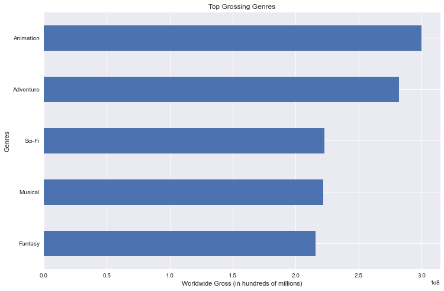

# Microsoft Movie Analysis

**Author**: Justin Balwan

## Overview

This project focuses on providing Microsoft Movie Studio with recommendations on how they can produce successful films.
Given a dataset containing files from popular film related websites, descriptive analysis was conducted to discover the top grossing genres, top grossing years, and top grossing studios. The results were used for recommendations, and Microsoft Movie Studio can effectively utilize these recommendations to create attractive, successful films.

## Business Problem

Microsoft's main objective with this project is to determine which films are currently doing the best in the box office. Doing so aids Microsoft in deciding which type of films they want to produce. When deciding how to properly portray the current successful films, I chose to analyze the top worldwide grossing films. Even though a film may be rated poorly, it still has the ability to top the charts in the box office. All other measures of success – such as rating or popularity – are subjective and inaccurately portray how well a film is doing. If Microsoft implements changes based on the factors that makes these top grossing films stay at the top, they will experience success of their own.

## Data

To conduct this project, I was provided with a large movie database that contained several files from various movie critic websites. The data represented in this project were taken from the websites Box Office Mojo, IMDB, and The Numbers. The files used in this project represented movie-related factors, such as genre, year, and studio. Given the target variable worldwide success, I used each of these factors and filtered them to show the top worldwide grossing element of each. 

## Methods

For this project, descriptive analysis was conducted to show the top worldwide grossing genres, years, and studios. This provides Microsoft's Movie Studio with the necessary information to create successful films. 

## Results

The top grossing genres were Fantasy, Musical, Sci-Fi, Adventure, and Animation.

### Top Grossing Genres



The top grossing years were 2010, 2012, 2016, 2017, and 2018.

### Top Grossing Years


The top grossing studios were MUBI, Spanglish, Super, Blue Fox, and RLJ. 

### Top Grossing Studios


## Conclusions
The analysis conducted produced three effective recommendations for Microsoft's Movie Studio: 

__Create movies that are either fantasies, musicals, sci-fi's, adventures, or animations.__ Given the first results graph which depicts worldwide gross in correspondence to genres, Microsoft's Movie Studio should produce movies under these genres to reach a larger audience for their movies.

__Study top movies from the years 2010, 2012, 2016, 2017, and 2018.__ The second results graph depicted the top worldwide grossing years. Microsoft's Movie Studio can view these years and study all kinds of variables – such as directors, actors/actresses, or regions – to see what went right. Hopefully, they will be able to emulate the tactics discovered.

__Build partnerships with studios such as MUBI, Spanglish, Super, Blue Fox, or RLJ.__ The third results graph depicted the top worldwide grossing studios. Since Microsoft's Movie Studio is a new studio, it will be difficult for them to compete against long-standing, already successful companies. Partnerships will make it easier for Microsoft's Movie Studio swiftly gain traction and become successful in a shorter time.


## For More Information

Please review my full analysis in [my Jupyter Notebook](./Microsoft_Movie_Analysis.ipynb) or my [presentation](./presentation.pdf).

For any additional questions, please contact **Justin Balwan || justinbalwan20@gmail.com**

## Repository Structure

Describe the structure of your repository and its contents, for example:

```
├── README.md                           <- The top-level README for reviewers of this project
├── Microsoft_Movie_Analysis.ipynb   <- Narrative documentation of analysis in Jupyter notebook
├── Microsoft_Movie_Analysis.pdf         <- PDF version of project presentation
├── data                                <- Both sourced externally and generated from code
└── images                              <- Both sourced externally and generated from code
```


